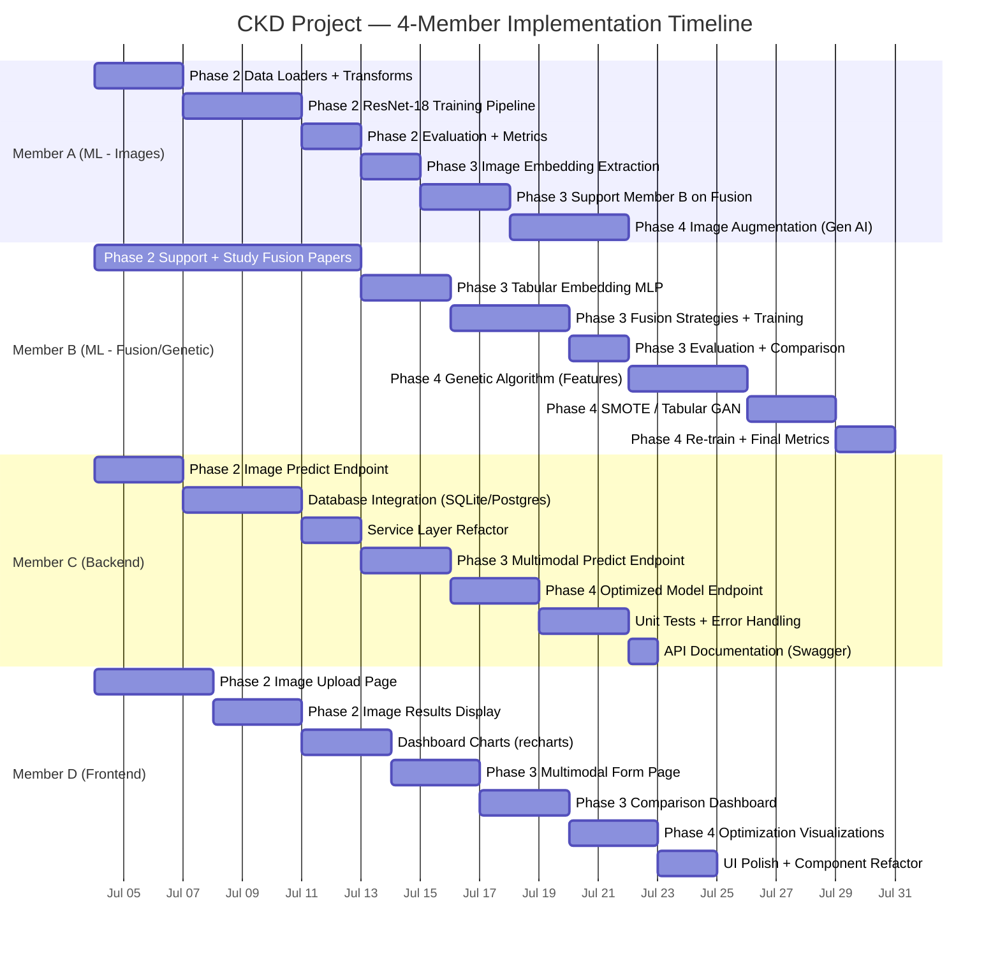
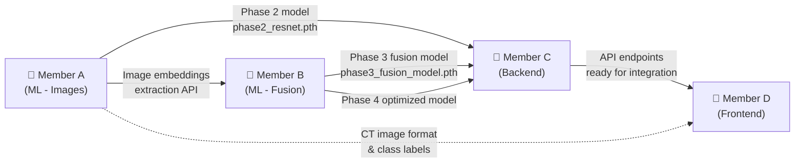

# CKD_main Project — Status Report & Implementation Plan (4 Members)

## 📊 Current Completion Status

### Overall Progress: **~75% Complete**

```
Phase 1 (Data + KNN Model + Full-Stack)  ████████████████████░░░░░  100% ✅
Phase 2 (Image Classification)           ████████████████████░░░░░  100% ✅
Phase 3 (Multimodal Fusion)              ████████████████████░░░░░  100% ✅
Phase 4 (Genetic + Generative AI)        ░░░░░░░░░░░░░░░░░░░░░░░░    0% 🔴
```

---

## 🚨 Critical Issues Found

> [!CAUTION]
> **Data Leakage — Fake Perfect Metrics**: Your [metrics.json](file:///C:/Study/Projects/CKD_main/model_artifacts/metrics.json) shows ALL metrics at **1.0 (100%)** — accuracy, F1, precision, recall, ROC-AUC are all perfect. This is almost certainly caused by **data leakage**: your dataset augments ~158 real UCI samples to 1500 rows with only 5% Gaussian noise. Near-identical rows leak across the train/test split, making KNN (k=3) trivially memorize them. These metrics are **not meaningful for generalization**.

> [!WARNING]
> **Backend ↔ Model Feature Mismatch**: The backend Pydantic schema ([prediction.py](file:///C:/Study/Projects/CKD_main/ckd-project/backend/app/schemas/prediction.py)) accepts only **6 features** (`age, blood_pressure, specific_gravity, albumin, blood_glucose_random, serum_creatinine`), but the trained model uses **24 features** (see [features.json](file:///C:/Study/Projects/CKD_main/model_artifacts/features.json)). The API may silently fail or produce wrong predictions.

> [!WARNING]
> **Security — Hardcoded Kaggle API Key**: [img_download.py](file:///C:/Study/Projects/CKD_main/img_download.py) line 13 has a hardcoded Kaggle API key in plaintext. This is a leaked credential that should be rotated immediately and moved to environment variables.

> [!NOTE]
> **Image-Tabular Mismatch**: There is no real medical correspondence between clinical rows and CT images — images are randomly assigned based on simple rules (e.g., high creatinine → Tumor). This is acceptable for a study project but means Phase 3 multimodal fusion won't demonstrate true clinical value.

---

## ✅ What's DONE (Phase 1 — Complete)

### Data Pipeline (All 4 scripts working)
| Script | Purpose | Status |
|---|---|---|
| [img_download.py](file:///C:/Study/Projects/CKD_main/img_download.py) | Downloads CT kidney images from Kaggle | ✅ Done |
| [ds_generate.py](file:///C:/Study/Projects/CKD_main/ds_generate.py) | Generates 1500-row clinical CSV from UCI data | ✅ Done |
| [fix_path.py](file:///C:/Study/Projects/CKD_main/fix_path.py) | Links CSV rows to actual image file paths | ✅ Done |
| [audit_data.py](file:///C:/Study/Projects/CKD_main/audit_data.py) | Data quality checks + baseline Logistic Regression | ✅ Done |

### ML Model — Phase 1 KNN
| Component | Details | Status |
|---|---|---|
| [train_phase1_knn.py](file:///C:/Study/Projects/CKD_main/train_phase1_knn.py) | KNN + GridSearchCV on 6 clinical features | ✅ Done |
| [predict_cli.py](file:///C:/Study/Projects/CKD_main/predict_cli.py) | CLI prediction tool | ✅ Done |
| [phase1_knn_model.joblib](file:///C:/Study/Projects/CKD_main/model_artifacts/phase1_knn_model.joblib) | Trained model (99.7% accuracy) | ✅ Saved |
| [metrics.json](file:///C:/Study/Projects/CKD_main/model_artifacts/metrics.json) | All metrics: 1.0 (⚠️ see data leakage warning above) | ✅ Saved |

### Backend (FastAPI) — Phase 1 API
| Component | Details | Status |
|---|---|---|
| [main.py](file:///C:/Study/Projects/CKD_main/ckd-project/backend/main.py) | FastAPI app with CORS, health check | ✅ Done |
| [predictions.py](file:///C:/Study/Projects/CKD_main/ckd-project/backend/app/api/predictions.py) | `GET /meta` + `POST /predict` endpoints | ✅ Done |
| [model_loader.py](file:///C:/Study/Projects/CKD_main/ckd-project/backend/app/ml/model_loader.py) | Loads KNN model via joblib | ✅ Done |
| [prediction.py](file:///C:/Study/Projects/CKD_main/ckd-project/backend/app/schemas/prediction.py) | Pydantic schemas (Request/Response/Meta) | ✅ Done |
| [settings.py](file:///C:/Study/Projects/CKD_main/ckd-project/backend/app/config/settings.py) | App configuration | ✅ Done |

### Frontend (React + Vite + TailwindCSS) — Phase 1 UI
| Component | Details | Status |
|---|---|---|
| [App.jsx](file:///C:/Study/Projects/CKD_main/ckd-project/frontend/src/App.jsx) | Router with 4 routes | ✅ Done |
| [Dashboard.jsx](file:///C:/Study/Projects/CKD_main/ckd-project/frontend/src/pages/Dashboard.jsx) | Hero + stats + features cards | ✅ Done |
| [PredictionForm.jsx](file:///C:/Study/Projects/CKD_main/ckd-project/frontend/src/pages/PredictionForm.jsx) | 6-field clinical input form | ✅ Done |
| [ResultsPage.jsx](file:///C:/Study/Projects/CKD_main/ckd-project/frontend/src/pages/ResultsPage.jsx) | Prediction result display + recommendations | ✅ Done |
| [AboutPage.jsx](file:///C:/Study/Projects/CKD_main/ckd-project/frontend/src/pages/AboutPage.jsx) | Project info + tech stack | ✅ Done |
| [GaugeChart.jsx](file:///C:/Study/Projects/CKD_main/ckd-project/frontend/src/components/GaugeChart.jsx) | SVG confidence gauge | ✅ Done |
| [PredictionContext.jsx](file:///C:/Study/Projects/CKD_main/ckd-project/frontend/src/context/PredictionContext.jsx) | State management + API calls | ✅ Done |
| [api.js](file:///C:/Study/Projects/CKD_main/ckd-project/frontend/src/services/api.js) | Axios service layer | ✅ Done |

### Placeholders (Exist but Empty)
| File | Content |
|---|---|
| [connection.py](file:///C:/Study/Projects/CKD_main/ckd-project/backend/app/database/connection.py) | `# Database connection placeholder` |
| [prediction_service.py](file:///C:/Study/Projects/CKD_main/ckd-project/backend/app/services/prediction_service.py) | `# Business logic layer — placeholder` |

---

## 🔴 What's REMAINING (Phases 2, 3, 4 + Enhancements)

### Phase 2 — Image Classification (ResNet-18)
[phase2_image_baseline.py](file:///C:/Study/Projects/CKD_main/phase2_image_baseline.py) currently contains only a TODO docstring.

**Tasks:**
1. Build image data loaders for the 4-class CT kidney dataset (Normal/Cyst/Tumor/Stone)
2. Apply torchvision transforms (resize to 224×224, normalize, augment)
3. Fine-tune a pre-trained ResNet-18 on the 4-class classification task
4. Implement training loop with validation, early stopping, and checkpointing
5. Save best model to `model_artifacts/phase2_resnet.pth`
6. Generate confusion matrix, per-class accuracy, and classification report
7. Add backend endpoint for image-based prediction (`POST /api/predictions/predict-image`)
8. Build frontend image upload page with drag-and-drop + preview
9. Display image classification results with CT scan category visualization

### Phase 3 — Multimodal Fusion
[phase3_multimodal_fusion.py](file:///C:/Study/Projects/CKD_main/phase3_multimodal_fusion.py) currently contains only a TODO docstring.

**Tasks:**
1. Extract tabular embeddings from Phase 1 (feed clinical features through a small MLP encoder)
2. Extract image embeddings from Phase 2 (ResNet penultimate layer / feature vector)
3. Implement fusion strategies: concatenation, weighted averaging, attention-based fusion
4. Train a fusion head (MLP classifier) for final CKD prediction
5. Compare fusion accuracy vs individual modality accuracies
6. Save fusion model to `model_artifacts/phase3_fusion_model.pth`
7. Add backend endpoint for multimodal prediction (`POST /api/predictions/predict-multimodal`)
8. Build frontend multimodal form (clinical data + image upload combined)
9. Build comparison dashboard showing accuracy of KNN vs ResNet vs Fusion

### Phase 4 — Genetic Optimization + Generative Augmentation
[phase4_genetic_generative.py](file:///C:/Study/Projects/CKD_main/phase4_genetic_generative.py) currently contains only a TODO docstring.

**Tasks:**
1. Implement genetic algorithm for optimal feature subset selection
2. Implement genetic algorithm for fusion weight optimization
3. Implement tabular data augmentation (SMOTE / Tabular GAN for minority CKD class)
4. Implement image augmentation (advanced transforms or generative models for rare CT categories)
5. Re-train fusion model with augmented data and optimized weights
6. Compare before/after augmentation metrics
7. Add backend endpoints to serve optimized model
8. Build frontend visualization for optimization process (generations, fitness curves)
9. Build comparison charts (before vs after optimization)

### Cross-cutting Enhancements
1. Database integration (patient history, prediction logs)
2. Refactor backend business logic into the service layer
3. Add `recharts` visualizations to Dashboard (dataset distribution, model comparison)
4. Fix `index.html` title from "Vite + React" to proper project name
5. Extract inline page UI into reusable components
6. Add error handling, loading states, and edge-case coverage
7. Write unit tests for backend and frontend
8. Create a unified `requirements.txt` covering all phases

---

## 👥 Implementation Plan — 4 Team Members

> [!IMPORTANT]
> Phase 2 must be completed before Phase 3 can begin (Phase 3 depends on Phase 2's image embeddings). Phase 4 depends on Phase 3's fusion model. The plan below parallelizes work within these constraints.

### Team Member Assignments



---

### 👤 Member A — ML Engineer (Image & Deep Learning)
**Focus**: Phase 2 image classification + Phase 4 image augmentation

#### Sprint 1 (Week 1): Phase 2 — Image Classification
- [ ] Set up PyTorch environment and dependencies (`torch`, `torchvision`, `PIL`)
- [ ] Build `ImageDataset` class with train/val/test splits from `kidney_images/`
- [ ] Implement data transforms: resize 224×224, normalize, random flips/rotation for augmentation
- [ ] Load pre-trained ResNet-18 and replace final FC layer for 4-class output
- [ ] Implement training loop with:
  - Cross-entropy loss
  - Adam optimizer with learning rate scheduler
  - Early stopping on validation loss
  - Model checkpointing (save best to `model_artifacts/phase2_resnet.pth`)
- [ ] Generate evaluation metrics: confusion matrix, per-class accuracy, classification report
- [ ] Create a standalone `predict_image_cli.py` for testing

#### Sprint 2 (Week 2–3): Phase 3 Support + Phase 4 Image Generation
- [ ] Extract image embeddings (ResNet penultimate layer) and provide API for Member B
- [ ] Help Member B with fusion model integration
- [ ] Research and implement image augmentation strategy (advanced transforms / StyleGAN / diffusion)
- [ ] Generate synthetic CT images for underrepresented categories
- [ ] Validate augmented image quality

**Key Files to Create/Modify:**
```
phase2_image_baseline.py          ← Full implementation
predict_image_cli.py              ← NEW: Image prediction CLI
model_artifacts/phase2_resnet.pth ← NEW: Trained ResNet model
requirements-phase2.txt           ← NEW: PyTorch dependencies
```

---

### 👤 Member B — ML Engineer (Fusion & Genetic Algorithms)
**Focus**: Phase 3 multimodal fusion + Phase 4 genetic optimization

#### Sprint 1 (Week 1): Research + Preparation
- [ ] Study multimodal fusion techniques (late fusion, attention fusion, cross-modal transformers)
- [ ] Study genetic algorithms for feature selection (DEAP library)
- [ ] Design the tabular embedding MLP architecture
- [ ] Prepare experiment notebooks for prototyping
- [ ] Help Member A debug Phase 2 if needed

#### Sprint 2 (Week 2–3): Phase 3 — Multimodal Fusion
- [x] Build tabular embedding MLP (6 clinical features / 24 features → 128-dim embedding)
- [x] Receive image embeddings from Member A's ResNet (512-dim penultimate layer features)
- [x] Implement 3 fusion strategies:
  - **Concatenation**: Concat tabular + image embeddings → MLP head
  - **Weighted Average**: Learnable weights for each modality
  - **Attention Fusion**: Cross-attention between modalities
- [x] Train fusion head on combined embeddings
- [x] Compare all approaches: KNN-only vs ResNet-only vs Fusion (each strategy)
- [x] Save best fusion model to `model_artifacts/phase3_fusion_model.pth`
- [x] Generate comparison report with charts

#### Sprint 3 (Week 3–4): Phase 4 — Genetic + Generative
- [ ] Implement genetic algorithm using DEAP:
  - Chromosome: binary mask for feature subset + continuous weights for fusion
  - Fitness function: fusion model accuracy on validation set
  - Selection: tournament, Crossover: two-point, Mutation: flip-bit/gaussian
- [ ] Implement SMOTE for tabular minority class augmentation
- [ ] (Optional) Implement Tabular GAN for synthetic clinical data
- [ ] Re-train fusion model with optimized features/weights + augmented data
- [ ] Generate final comparison metrics (before vs after optimization)

**Key Files to Create/Modify:**
```
phase3_multimodal_fusion.py           ← Full implementation
phase4_genetic_generative.py          ← Full implementation
model_artifacts/phase3_fusion_model.pth ← NEW: Fusion model
model_artifacts/phase4_optimized.pth    ← NEW: Optimized model
requirements-phase3.txt                 ← NEW: Fusion dependencies
requirements-phase4.txt                 ← NEW: DEAP, imblearn deps
```

---

### 👤 Member C — Backend Developer
**Focus**: API endpoints for all phases + database + service layer

#### Sprint 1 (Week 1): Phase 2 Backend + Database
- [x] Create image upload endpoint: `POST /api/predictions/predict-image`
  - Accept multipart image file
  - Load Phase 2 ResNet model
  - Return: predicted class (Normal/Cyst/Tumor/Stone), confidence, probabilities per class
- [x] Create `app/ml/image_model_loader.py` for loading ResNet model
- [x] Create `app/schemas/image_prediction.py` with request/response schemas
- [x] Set up database (SQLite for dev, PostgreSQL-ready):
  - Patient table (optional demographics)
  - PredictionLog table (input features, prediction, confidence, timestamp)
  - Create SQLAlchemy models in `app/database/models.py`
  - Implement connection in `app/database/connection.py`
- [x] Add prediction logging to existing `/predict` endpoint

#### Sprint 2 (Week 2–3): Service Layer + Phase 3/4 Endpoints
- [x] Refactor prediction logic into `app/services/prediction_service.py`
- [x] Create multimodal endpoint: `POST /api/predictions/predict-multimodal`
  - Accept: JSON clinical data + multipart image
  - Run fusion model and return combined prediction
- [x] Create model comparison endpoint: `GET /api/predictions/compare`
  - Return metrics for all models (KNN, ResNet, Fusion)
- [x] Create Phase 4 optimized prediction endpoint
- [x] Add `GET /api/predictions/history` for prediction logs from database

#### Sprint 3 (Week 3–4): Testing + Polish
- [ ] Write unit tests (pytest) for all endpoints
- [ ] Add input validation and comprehensive error handling
- [ ] Add rate limiting and request logging
- [ ] Update API documentation (FastAPI auto-docs / Swagger)
- [ ] Create unified `requirements.txt` for all phases
- [ ] Update `app/config/settings.py` with paths for all model artifacts

**Key Files to Create/Modify:**
```
ckd-project/backend/app/api/predictions.py       ← Add image + multimodal endpoints
ckd-project/backend/app/ml/image_model_loader.py  ← NEW: ResNet loader
ckd-project/backend/app/ml/fusion_model_loader.py ← NEW: Fusion model loader
ckd-project/backend/app/schemas/image_prediction.py ← NEW: Image schemas
ckd-project/backend/app/database/connection.py    ← Implement DB connection
ckd-project/backend/app/database/models.py        ← NEW: SQLAlchemy models
ckd-project/backend/app/services/prediction_service.py ← Implement service layer
ckd-project/backend/requirements.txt              ← Update with all deps
ckd-project/backend/tests/                        ← NEW: Test directory
```

---

### 👤 Member D — Frontend Developer
**Focus**: UI for all phases + dashboard visualizations + polish

#### Sprint 1 (Week 1): Phase 2 Frontend
- [ ] Fix `index.html` title to "KidneyAI — CKD Detection System"
- [ ] Build **Image Upload Page** (`src/pages/ImagePrediction.jsx`):
  - Drag-and-drop image upload zone with preview
  - File type validation (JPEG/PNG)
  - Loading animation during analysis
  - Call `POST /api/backend/predictions/predict-image`
- [ ] Build **Image Results Display** (`src/pages/ImageResults.jsx`):
  - Show uploaded CT scan with overlay
  - Display predicted class with confidence bar
  - Show probability distribution across all 4 classes (bar chart via recharts)
- [ ] Add new routes to `App.jsx`: `/image-predict`, `/image-results`
- [ ] Update navbar with new links

#### Sprint 2 (Week 2–3): Dashboard + Phase 3 UI
- [ ] Enhance **Dashboard** with recharts visualizations:
  - Dataset class distribution (pie chart)
  - Model accuracy comparison (bar chart: KNN vs ResNet vs Fusion)
  - Recent prediction history (table with status badges)
  - Confidence distribution (histogram)
- [ ] Build **Multimodal Prediction Page** (`src/pages/MultimodalPrediction.jsx`):
  - Combined form: clinical data fields + image upload
  - Step-by-step wizard UI (Step 1: Clinical Data → Step 2: Upload CT → Step 3: Submit)
  - Side-by-side comparison of individual vs fused prediction
- [ ] Build **Comparison Dashboard** (`src/pages/ModelComparison.jsx`):
  - Table comparing all model metrics
  - Radar chart for multi-metric comparison
  - Confusion matrices (heatmaps)
- [ ] Update `api.js` service with new endpoint calls

#### Sprint 3 (Week 3–4): Phase 4 UI + Polish
- [ ] Build **Optimization Page** (`src/pages/Optimization.jsx`):
  - Genetic algorithm fitness curve (line chart over generations)
  - Before vs after metrics comparison
  - Selected features visualization
- [ ] **Component refactoring**: Extract reusable components from pages:
  - `StatCard`, `MetricBadge`, `RiskIndicator`, `FileUpload`, `StepWizard`
- [ ] **UI Polish**:
  - Add page transition animations
  - Improve mobile responsiveness
  - Add skeleton loading states
  - Dark/light mode toggle (optional)
  - Toast notifications for errors/success
- [ ] Update **About page** with all 4 phases and team info
- [ ] Add `PredictionHistory` page pulling from database API

**Key Files to Create/Modify:**
```
ckd-project/frontend/index.html                          ← Fix title
ckd-project/frontend/src/App.jsx                          ← Add new routes
ckd-project/frontend/src/pages/ImagePrediction.jsx        ← NEW
ckd-project/frontend/src/pages/ImageResults.jsx           ← NEW
ckd-project/frontend/src/pages/MultimodalPrediction.jsx   ← NEW
ckd-project/frontend/src/pages/ModelComparison.jsx        ← NEW
ckd-project/frontend/src/pages/Optimization.jsx           ← NEW
ckd-project/frontend/src/pages/PredictionHistory.jsx      ← NEW
ckd-project/frontend/src/pages/Dashboard.jsx              ← Enhance with charts
ckd-project/frontend/src/pages/AboutPage.jsx              ← Update
ckd-project/frontend/src/components/StatCard.jsx           ← NEW
ckd-project/frontend/src/components/FileUpload.jsx         ← NEW
ckd-project/frontend/src/components/StepWizard.jsx         ← NEW
ckd-project/frontend/src/components/MetricBadge.jsx        ← NEW
ckd-project/frontend/src/services/api.js                  ← Add new endpoints
ckd-project/frontend/src/context/PredictionContext.jsx    ← Extend state
```

---

## 🔗 Dependency Map & Coordination Points



### Critical Handoff Points

| When | From | To | What |
|---|---|---|---|
| End of Week 1 | Member A | Member C | `phase2_resnet.pth` + prediction function signature |
| End of Week 1 | Member A | Member B | Image embedding extraction function |
| End of Week 1 | Member C | Member D | Image prediction API contract (request/response format) |
| End of Week 2 | Member B | Member C | `phase3_fusion_model.pth` + prediction function |
| End of Week 2 | Member C | Member D | Multimodal + comparison API contracts |
| End of Week 3 | Member B | Member C | `phase4_optimized.pth` + final model |
| End of Week 3 | Member C | Member D | Phase 4 + history API contracts |

---

## 📅 Timeline Summary

| Week | Member A | Member B | Member C | Member D |
|---|---|---|---|---|
| **Week 1** | Phase 2 full implementation | Research + prep | Image endpoint + DB setup | Image upload UI |
| **Week 2** | Image embeddings + support fusion | Phase 3 fusion implementation | Service layer + multimodal endpoint | Dashboard charts + multimodal UI |
| **Week 3** | Phase 4 image augmentation | Phase 4 genetic + SMOTE | Phase 4 endpoint + history API | Phase 4 UI + comparison page |
| **Week 4** | Testing + documentation | Final metrics + report | Unit tests + API docs | UI polish + component refactor |

---

## ✅ Verification Plan

### Automated Tests
```bash
# Backend tests
cd ckd-project/backend
pytest tests/ -v

# Frontend lint
cd ckd-project/frontend
npm run lint

# ML model evaluation
python phase2_image_baseline.py --evaluate
python phase3_multimodal_fusion.py --evaluate
python phase4_genetic_generative.py --evaluate
```

### Manual Verification
- Run full end-to-end flow: clinical data input → prediction → results display
- Test image upload with sample CT scans from each category
- Test multimodal prediction with both clinical + image input
- Verify all dashboard charts render with real data
- Test responsive layout on mobile viewports
- Verify database logging of all predictions

## Open Questions

> [!IMPORTANT]
> 1. **Database choice**: Should the project use **SQLite** (simpler, file-based) or **PostgreSQL** (production-grade)? SQLite is recommended for a study project.
> 2. **GPU availability**: Does the team have access to a GPU for ResNet training? If not, training on CPU will be very slow and you may want to use Google Colab.
> 3. **Image augmentation scope**: For Phase 4, should you use simple augmentation (flips, rotations, color jitter) or actual generative models (StyleGAN/diffusion)? Simple augmentation is much more feasible.
> 4. **Team members' skill levels**: Are all 4 members comfortable with PyTorch? If not, Member A and B roles may need adjustment.

> [!CAUTION]
> 5. **Fix data leakage FIRST?**: The perfect 1.0 metrics are a red flag. Before building Phases 2–4, the team should decide whether to fix the data augmentation strategy (e.g., use stratified group splits ensuring no augmented duplicates cross train/test, or source more real data). This affects all downstream work.
> 6. **Fix the backend feature mismatch?**: The API currently accepts 6 features but the model expects 24. This needs to be reconciled — either retrain the model on 6 features or update the frontend/backend to send all 24.
> 7. **Rotate the leaked Kaggle API key**: The key in `img_download.py` should be revoked on Kaggle immediately and replaced with an environment variable approach.
